# unity-haven
Various tools or code snippets I developed when I was a Unity Game Developer

## Exporting all the tools to your project
1. Select _Core.Complete_ asset
2. Press on _Build and Pack_ in the Inspector
3. Wait for the compilation process to finish
4. Save the resulting Unity Asset Package
  * There are "normal" error displaying in Unity's console after the build is completed.
    * :exclamation: `Reload Assembly called from managed code directly. This will cause a crash. You should never refresh assets in synchronous mode or enter playmode synchronously from script code.`

    * :exclamation: `InvalidOperationException: Operation is not valid due to the current state of the object`
5. Import this package to your project
6. Follow the extra step of [Core.Drawing Installation Notes](#coredrawing-installation-notes)

## Core

### ExtendedInspector
It is highly recommended to checkout the project and experience it yourself.
[Source](Assets/Core/Demo/Attributes.cs)

#### Reorderable
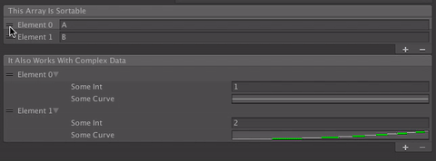

#### ToolTip
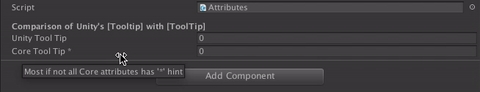

#### All
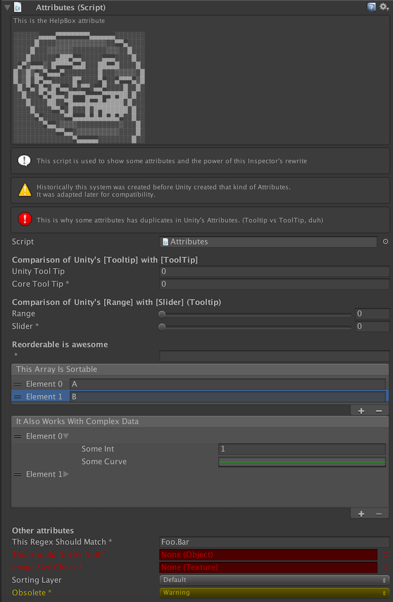

### Tools

#### Find References
1. Right-click on an asset
2. Select _Find Reference(s)_
3. Look at Unity's console for this kind of output:

```
[ Selected File(s) ]
Assets/Varia/Stencils/3DimensionCube/Shader/3DStandardMask.shader

[ Direct Reference(s) ]
Assets/Varia/Stencils/3DimensionCube/Material/XMask.mat
Assets/Varia/Stencils/3DimensionCube/Material/YMask.mat
Assets/Varia/Stencils/3DimensionCube/Material/ZMask.mat

[ Indirect Reference(s) or Rare Assets that have both direct AND indirect reference on the selected asset(s) ]
Assets/Varia/Stencils/3DimensionCube/3DimensionCube.prefab
Assets/Varia/UnityUICommonMistakes/FindTheMistakes.unity
```

#### NewScriptableObjectHelper

You can instantiate any scriptable through the menu `Asset/Create/ScriptableObject` or Right-click then select `Create/ScriptableObject`. A pop-up will appear somewhere in your screen then select the type of scriptable object you want.

#### Ordered Drag

Unity sorts selection by "instance id" which is fine most of the time.
When you need to drag ordered assets in an array or in the Hierarchy it can be a real hassle.

With *Ordered Drag* you just drag what you need ordered on the *Ordered Drag* window then you drag it out on where you need it.

Accessible through menu item "Window/Ordered Drag".

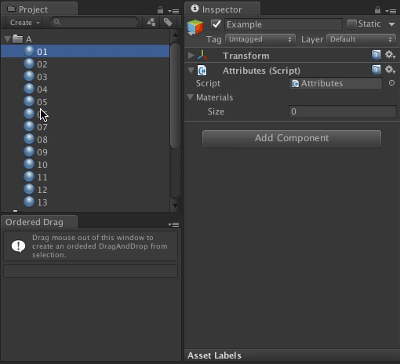

*Note: It may not be the most intuitive tool to use however it is the only way I found to do this. It is not possible to sort a selection while it is dragged (Ex: through shortcut or with a mouse over).*

#### External Tools 2

Unity pretty much open all text files in the *External Script Editor* configured in *External Tools* (Ex: MonoDevelop or Visual Studio). If you would like to use other editors for certain type of files, check the file and it will open it in the operating system's default editor. You can specify the syntax when Unity want to open it at a specific line. See the documentation of the editor.

*Examples:*
* `"{0}":{1}` will send `"path/to_the_file.cs":154`
* `"{0}" --line {1}` will send `"path/to_the_file.cs" --line 154`

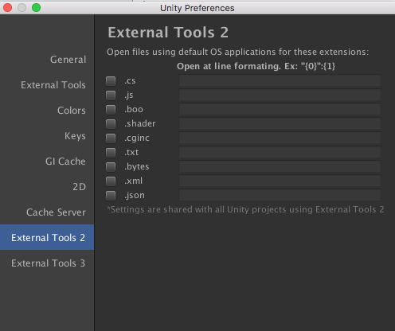

#### External Tools 3

Some text editors are much more complicated to configure. This tool allows you to specify the exact line the terminal must call to start the text editor.

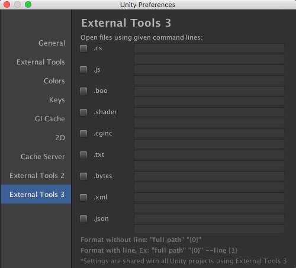


## Core.AssemblyPacker

## Core.Drawing

### Ditherer
| Original  | RGBA Without Dithering  | RGBA With Dithering |
|-----------|-------------------------|---------------------|
|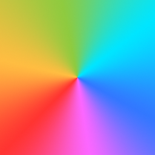. |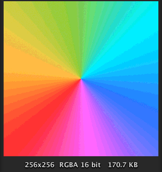 | 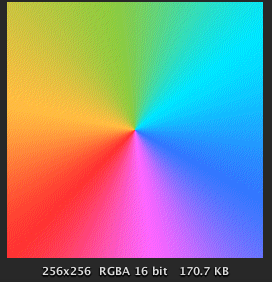|

This tool automatically converts 16bit images assets using [dithering](https://en.wikipedia.org/wiki/Dither) through [ImageMagick](https://www.imagemagick.org).

#### Core.Drawing Installation Notes

1. After installing the Unity Asset Package in your project
2. locate the zip file located in [Assets/Core.Drawing/ExternalTools.zip](Assets/Core.Drawing/ExternalTools.zip)
3. Unzip this archive at the root of your project folder (At the same level of `Assets`, `Library`, `ProjectSettings`, etc.)
4. Delete the folder `Assets/Core.Drawing`

## Core.UI

### Large Outline
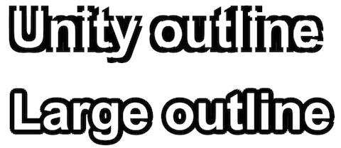

### Shear UI
### SpriteUV1

Adds a second normalized coordinate relative to the UI element. It allows to create special shaders in order to overlay the element (or else).

## Varia

### Stencil
A 3 dimensional cube (not a pleonasm)

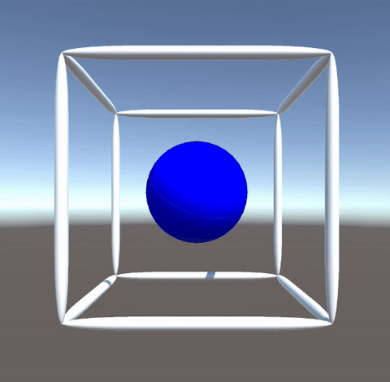

## Notes

Special thanks to [@elaberge](https://github.com/elaberge) for several contributions.

Note: The :trollface: image belongs to it's original owner and therefore is not part of this repository's licence.
